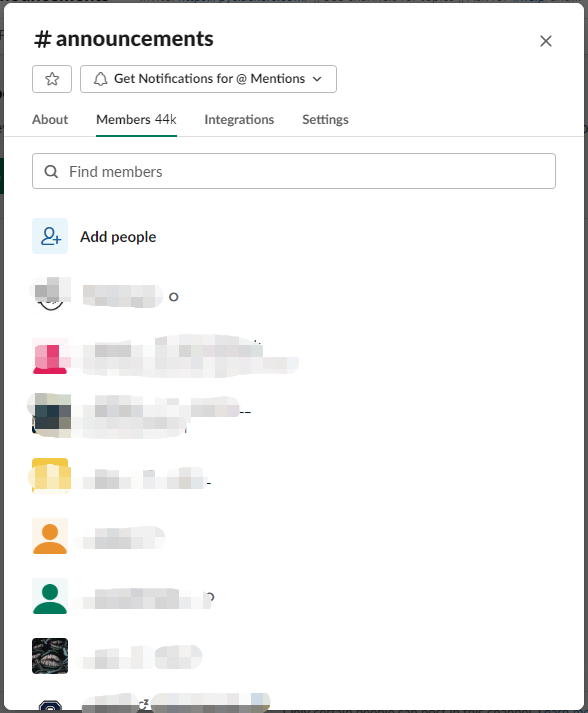
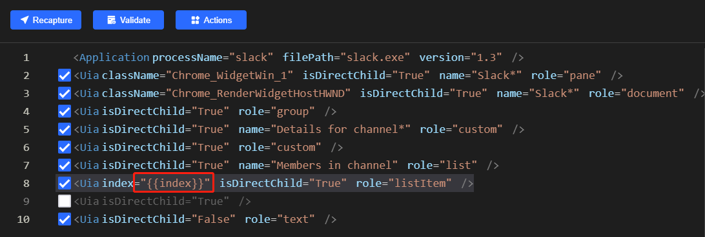
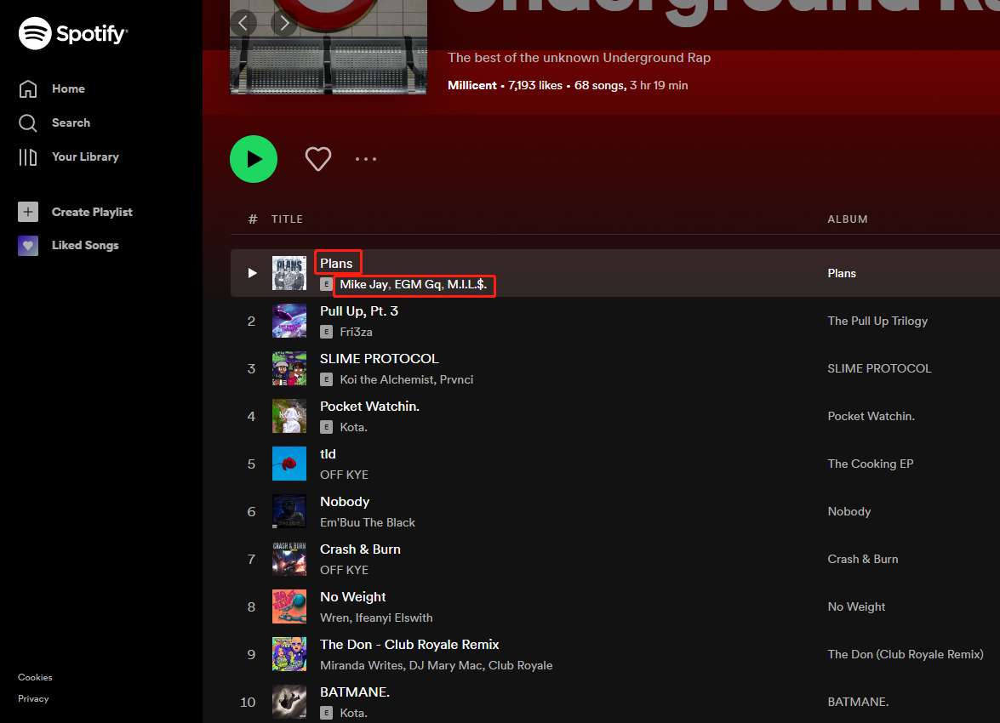

# Using index variable in locator to find a series elements
##  Introduction
From Clicknium [Locator](../concepts/locator.md) definition, it supports parametric locator.   
Users can use the parametric locator in the automation project to replace the ones with the varaibles or data. This allows the locator to match series of elements, instead of single target element.

We will show you two automation cases to demonstrate how to use index varaible in locator to find a series elements. 

>tip Notes  
>More about the installation and the tutorial of Clicknium Automation, please refer to [here](https://www.clicknium.com/documents).


## Scraping contact list on slack client

This is a real user scenario, which needs to grab user list information from a channel of slack. 



After recording one contact item's locator, user modify the locator with index variable.



Then use loop traversal to locate each contact element and get information.
```python
for i in range(1,13):
    dict = {"index":i}
    if not cc.is_existing(locator.slack.listitem_member, dict):
        continue
    elem_member = ui(locator.slack.listitem_member, dict)
    name = elem_member.get_text()
``` 

### Scraping playlist from spotify
This is a real user scenario, which needs to get the playlist information from [spotify](https://open.spotify.com/playlist/6iwz7yurUKaILuykiyeztu).

First locate "author" and "title" from one item in playlist.



As the page on spotify page is complicated and dynamic, user use "xpath" in locator.
And modify the locator with index variable.


Then use loop traversal to locate each item in playlist and get information.
```python
tab = cc.chrome.open("https://open.spotify.com/playlist/6iwz7yurUKaILuykiyeztu")
index = 2

titles = []
artists = []
links = []
while True:
    if not tab.is_existing(locator.chrome.open.div_title, {'index':index}):
        break
    title = tab.find_element(locator.chrome.open.div_title, {'index':index}).get_text()
    artist = []
    link = []
    element = tab.find_element(locator.chrome.open.div_author, {'index':index})
    authers = element.children
    for item in element.children:
        artist.append(item.get_text())
        link.append(item.get_property('href'))

    titles.append(title)
    artists.append(artist)
    links.append(link)
    index += 1
tab.close()
```