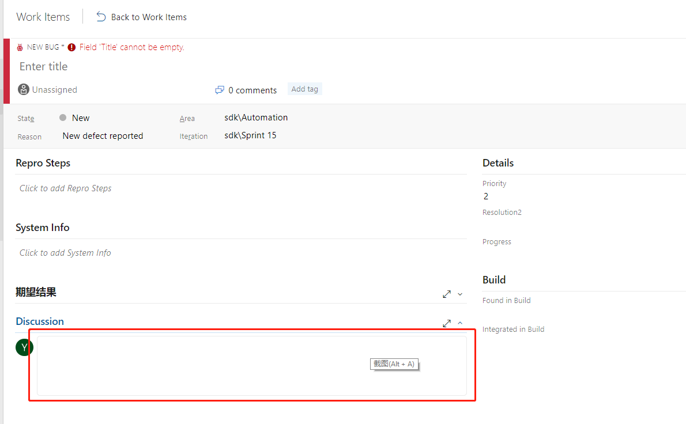
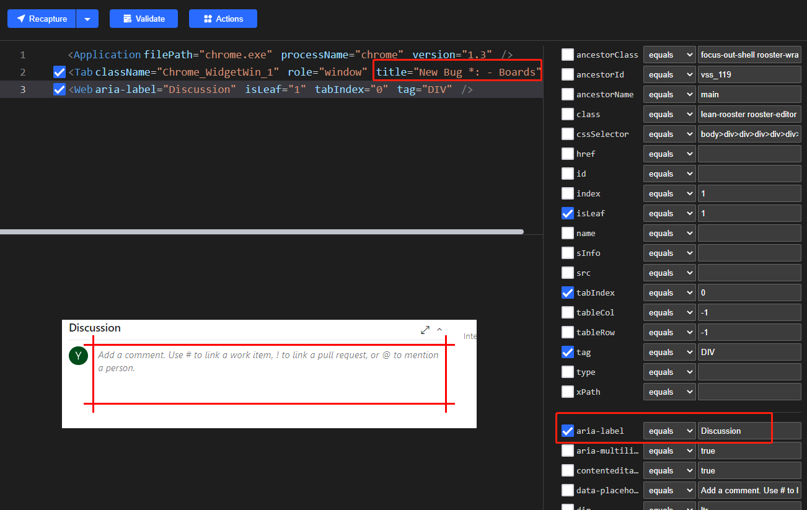

# How to use custom attributes to locate web element
##  Introduction
From [Locator](../concepts/locator.md) and [Web Automation](../concepts/web.md), you know which attributes Clicknium used to locate web element, such as "tag", "id", "name" and so forth.  
A web element may occasionally include additional attributes, some of which are significant and can be used to identify the web element.

## Version Requirement
[Clicknium Visual Studio Code Extension](https://marketplace.visualstudio.com/items?itemName=ClickCorp.clicknium) >= 0.1.9

[Clicknium Python Module](https://pypi.org/project/clicknium/) >= 0.1.8

:::tip Notes

More about the installation and the tutorial of Clicknium Automation, please refer to [here](https://www.clicknium.com/documents).

:::
## Samples
The example below demonstrates how to take advantage of this functionality.

### Sample 1: Azure devops new work item page

We want to locate the 'Discussion' input area.

- It is simple to generate the locator like the one below using Clicknium Recorder:

In this scenario, the "ancestorId" of the produced locator is dynamic; if you create a work item again, the "ancestorId" may change.
Given that Clicknium returns the values for all of the web element's attributes, choosing "aria-label" and excluding "ancestorId" will make the locator more dependable for this sample.

In order to be flexible, you should alter the "title" to "New Bug *: - Boards".
Please refer to [wildcard locator](../concepts/locator#wildcard-locator) and [Recapture and Compare](../tutorial/recorder/recapture&compare.md).