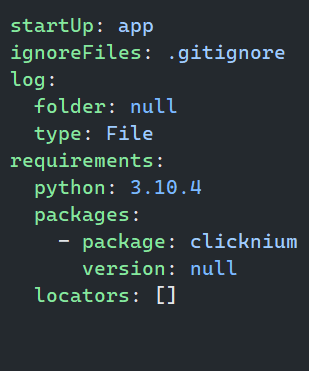
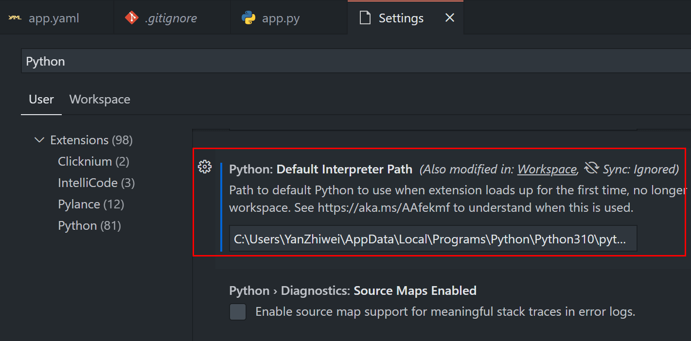
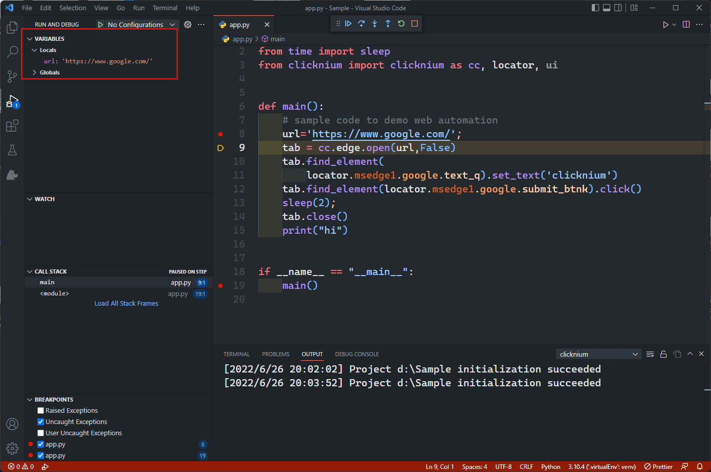
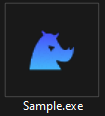

# Clicknium Project

## Overview
Clicknium project encapsulates Python automation files to guarantee the automation scripts having same result in developing, debugging, execution and distribution. A virtual Python environment will be created when Clicknium Project initialized. The isolated environment helps to keep the same behavior on different machine and avoid to disrupt the dev machine environment. Clicknium Project also support to be packaged into a executable file which is convenient to be delivered to end users.

## Create Project

In VS Code, press `Ctrl+Shift+P` to show the Command Palette, input `Clicknium: Create Project`, and then choose a folder to locate the project.

When the project is created, a pop-up window in the lower right corner shows the general project intialization information and the output panel shows details. After the  initialization, the current Python virtual enviroment can be seen when you open app.py.  

### Project Structure

1. **app.py**: a Python file where the main function is the execution entry of the project.
   

2. **clicknium.yaml**: configuration file where you can configure Python version, Python packages, project entry file and locator store references, etc for the project.  
   
   
   - **startUp**: The project entry file, if you want to change the project run entry file to another file, fill the file name without suffix in this field.  
   
   - **log**：The project log. Its property "folder" indicates the location of the log files to be saved. If its value is not specified, the default location is %LOCALAPPDATA%\Clicknium\Log.
   
   - **requirements**：running project dependency.  
     &emsp;Python: Python version is 3.7.0 by default. In creating project, if VS Code already has at least one supported version Python installed, clicknium extension will choose current selected Python interpreter to create the project, the Python version in this configuration file will be updated accordingly. If VS Code does not have Python installed, clicknium extension will install Python 3.7.0 as described in configuration file by default.
     
       
     &emsp;Packages：Python package dependency. In this configuration, you can add one or more Python packages required by this project in the format of package-version. If the version is blank or null, the latest version will be used automatically.  
       
     &emsp;If there is no required Python package dependency，it will be configured as [].  
       
     &emsp;locators: The cloud locator repository dependency, configured in the same way as Python package dependency.

3. **logo.ico**：The icon of executable file after packaging the project. You may replace this file if you want customize the executable file icon.  

4. **.gitignore**：When using Git, you can add or remove files that you want to ignore.

## Run/Debug Project in VS Code

### Run the project

In VS Code, press "Ctrl+Shift+P" to show the Command Palette, input or select "Clicknium: Run Project". The clicknium extension will deploy and run the project based on clicknium.yaml.
 

### Debug the project

#### Basics

In VS Code, set a breakpoint to the code where you want to pause,
press `Ctrl+Shift+P` to show the Command Palette, input or select "Clicknium: Debug Project". The clicknium extension will start projec debugging with debug buttons shown at the top of VS Code.  
  
- Continue (F5) / Pause (F6)  
- tep over (F10)  
- Step in (F11)  
- Step out (Shift + F11)  
- Restart (Ctrl+Shift+F5)  
-  (Shift + F5)  

#### Monitor Variables

In the upper left corner of VS Code, you can see the variables is debugging the running values.  

#### Debug Console

In VS Code, open the debug console by "View -> Debug Console"   

# Project Package
After the Clicknium project development finished, you can package it into a executable file. The end users of the automation script might not be developer. When they get the executable file, double click the file then it start to run.  
## How to
In VS Code, press `Ctrl+Shift+P` to show the Command Palette, input or select `Clicknium: Package Project`, then select the path to save the executable file.

The detailed package log Output displays in the Output in Visual Studio Code.

Once the package is done, the saving folder will be opened to show the target executable file.

If you want to replace the Exe icon, replace the logo.ico file in the project file. 
