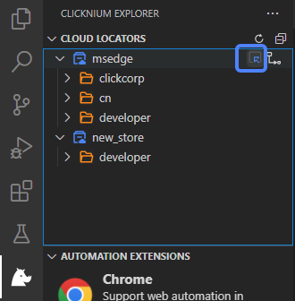

# Capture UI Elements

## How to start recorder
- Start from Visual Studio Code LOCATORS tab  

- Start capture in Visual Studio Code CLOUD LOCATORS tab  

- Start by pressing hotkey `Ctrl+F10`  

## Capture methods

Clicknium provides three recording methods: 
- single capture
- continuous capture
- image capture.

> **Remarks:**
>- The new recorded locator will be added into current selected locator store.

### Select capture technology and advanced option
We can select the capture technology and the advanced option with each capture method. For more information, please refer to [Capture Technology](#capture-technology) and [Capture Advanced Option](#capture-advanced-option).

### Single capture

1. Select UI element  
Along the mouse moving, it will highlight the UI element and show its position on recorder panel.

2. Press `Ctrl + click`
3. Click the button `Complete`  

### Continuous capture

1. Operate for multiple times by "Selecting UI element and Pressing `Ctrl + click`" to add more locators
2. Click the button `Complete` on recorder panel

### Image capture

1. Select a UI element  
2. Press `Shift` and select an area of the element with the mouse
3. Validate image locators as below:  

4. Click the button `Complete` on recorder panel

## Capture technology

The supporting capture technologies are as follows `UIA`, `IA`, `Java`, `IE`, `Chrome`, `Firefox`, `Edge` and `SAP`.  
The default technology is `Auto Detect`, which means the recorder will automatically select the technology.  
For web UI element, you can choose `IE`, `Chrome`, `Firefox` or `Edge` capture technology according to your browser type.  
For SAP application, you can choose `SAP` capture technology.  
For Java application, you can choose `Java` capture technology.  
For window UI element, you can choose `UIA` or `IA` capture technology.  
 

## Capture advanced option

Default advanced option is `None`. When recording web UI element, you can also select XPath to generate an XPath string.    

您好！首先感谢开发clicknium，尝试使用期间觉得非常好用。来信请教一些可能比较小白的问题，
还望不吝指教:我目前在尝试使用clicknium来写一个自动化的应用，用来下载工作中的一堆报表。这些报表页面显示结构比较类似，点开不同的报表之后后续的操作都是一样的，所以我想写一个循环来点开报表。
现在问题是我已经捕获到所有的报表locator，但是不知道怎么实现遍历。
我已经查看过document中关于locator的参数遍历的内容，但是很惭愧没有看懂。
我已经把需要遍历的locator放到 locactor.chrome.ybyb.ybbbs文件夹下，
请问怎么实现遍历这个文件夹下的locator呢？盼回信，谢谢！